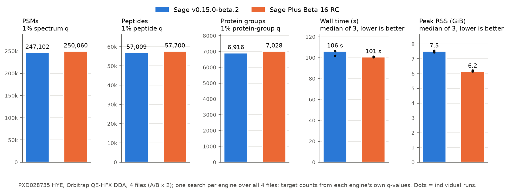

# Sage Plus

[](https://github.com/pgarrett-scripps/sage-plus/actions/workflows/rust.yml) [](https://github.com/lazear/sage)

Sage Plus is a fork of the [Sage proteomics search engine](https://github.com/lazear/sage) for
people who need more than a standard closed search: very large or PTM-heavy databases, site
localization, Thermo RAW input without conversion, and machine-readable outputs. It keeps Sage's
workflow and configuration style, and most additions are opt-in. The current release is
**v0.1.0-beta.16**, a prerelease.

## Why Sage Plus

Each of these was measured on the dataset named. With the streamed prefilter, a human reference
plus a 100x gut-microbiome catalog searches in 19 GiB (14,459 PSMs in 451 s,
[Beta 11](CHANGELOG.md#v010-beta11---2026-09-26)). Per-type false-localization rates give 7,231
phospho localizations at 1% FLR on PXD007058 ([details](DOCS.md#ptm-site-localization)).
Nonlinear retention-time alignment raised LFQ precursors at 1% q-value from 24,038 to 31,418 on
five PXD028735 runs ([Beta 9](CHANGELOG.md#v010-beta9---2026-09-25)). `z_dot` fragment ions find
43% more ETD PSMs than `z` on PXD018176 ([details](DOCS.md#fragment-settings)), and initiator
methionine clipping adds 3.4% PSMs at 1% FDR on HEK SILAC when protein N-terminal acetylation is
searched
([details](DOCS.md#initiator-methionine-clipping)).

Against upstream Sage v0.15.0-beta.2 on four PXD028735 HYE runs with the same settings, Sage Plus
finds 1.2% more PSMs and peptides and 1.6% more protein groups at 1% FDR, uses 18% less peak
memory (6.2 vs 7.5 GiB), and quantifies the species ratios as accurately
([head-to-head](benchmarks/HEADTOHEAD.md)). For a standard search the two are close; the
differences are in the features above.



> [!NOTE]
> Sage Plus is a beta, maintained independently of upstream Sage. Behavior can change between
> betas: pin a release, and validate results on your own data before publishing them.

## Install

Prebuilt binaries for every release are on the
[releases page](https://github.com/pgarrett-scripps/sage-plus/releases): Linux x86_64 and aarch64
(glibc and static musl builds), macOS x86_64 and arm64, and Windows x86_64. Each archive also
contains the documentation and output schemas. A Linux x86_64 container is published for each
release tag:

```shell
docker run --rm -v "$PWD":/data ghcr.io/pgarrett-scripps/sage-plus:<tag> sage -o /data /data/config.json
```

To build from source (Rust 1.97+):

```shell
git clone https://github.com/pgarrett-scripps/sage-plus.git && cd sage-plus
cargo build --release --workspace
./target/release/sage config.json
```

Quickstart (from Beta 16): write a preset configuration, then search a FASTA and spectrum files.

```shell
sage --write-config trypsin-hcd > config.json
sage -f proteins.fasta config.json run1.mzML run2.mzML
```

## Highlights

**Search very large databases in bounded memory.** With `prefilter` on, proteins stream through an
index of the spectra, and only peptides that could match a spectrum enter the search index. A human
reference plus a 100x gut-microbiome catalog, which ran out of memory before Beta 11, now finishes
in 19 GiB (14,459 PSMs in 451 s). See [settings](DOCS.md#fasta) and the
[Beta 11 measurements](CHANGELOG.md#v010-beta11---2026-09-26).

**Localize PTM sites with a false-localization rate.** `ptm_localization` rescores each arrangement
of a PSM's modifications on site-determining ions against impossible-site decoys, with a separate
false-localization rate per modification type (7,231 phospho localizations at 1% on PXD007058
with the Beta 15 defaults; 303 when all types were pooled before Beta 14). It writes site
probabilities and localization q-values to PSM-level and protein-level site tables, a site-level
target-decoy q-value (`site_q_value`), and a reusable site library. See [PTM site localization](DOCS.md#ptm-site-localization).

**Search modifications without growing the index.** Mass-offset modifications are placed at
scoring time instead of expanded into the fragment index: a phosphorylation search used 0.16 GB
instead of 0.45 GB with the same PSMs ([evaluation](benchmarks/MASS_OFFSET.md)). With neutral
losses, this also covers crosslinker monolinks. See [details](DOCS.md#mass-offset-modifications).

**Quantify more precursors across runs.** Retention times are aligned across runs with a nonlinear
warp by default. On five PXD028735 LFQ runs this raised precursors at 1% q-value from 24,038 to
31,418 and tightened the human log2 ratio spread. See [quantification](DOCS.md#quantification).

**Read instrument files directly.** Thermo RAW and mzMLb are read without conversion, and timsTOF
1/K0 uses the instrument calibration. Each spectrum carries its analyzer and activation (HCD, CID,
ETD, EThcD, ETciD), so recalibration never mixes scan types. See [inputs](DOCS.md#spectrum-paths).

## Features by outcome

### Find more, and more trustworthy, identifications

Better defaults and scoring for the spectra you already have.
- Initiator methionine clipping, on by default: 3.4% more PSMs at 1% FDR on HEK SILAC with protein N-terminal acetylation searched ([details](DOCS.md#initiator-methionine-clipping)).
- `z_dot` fragment ions for ETD and EThcD: 43% more ETD PSMs than Sage's `z` on PXD018176 ([details](DOCS.md#fragment-settings)).
- Search-time mass recalibration per file and per analyzer, kept only when it improves held-out error ([details](DOCS.md#other-settings)).
- Ambiguous residues: J scored as I/L, opt-in B/Z/X expansion with a `substitutions` column, I/L twins merged ([details](DOCS.md#ambiguous-residues)).
- Averagine-scored deisotoping, charge-aware fragment matching, and `ambiguity_sequence` marking unsupported regions ([details](DOCS.md#sequence-ambiguity-annotation)).
- Picked target-decoy FDR for peptides, proteins and protein groups: a target beaten by its own decoy no longer passes ([details](DOCS.md#protein-inference)).
- Opt-in immonium-ion evidence and water/ammonia fragment losses as extra rescoring features, reported per PSM ([details](DOCS.md#immonium-ions)).
- Opt-in DIA pseudo-spectrum mode for Orbitrap DIA and diaPASEF ([details](DOCS.md#dia-pseudo-spectrum-search)).

### Search PTMs with less setup

Say exactly where a modification can go, and check it before searching.
- Named modifications with explicit sites such as `first_residue:K` or `peptide_n_term` ([details](DOCS.md#explicit-site-vocabulary)).
- Motif sites such as `motif:N*-{P}-[ST]`, checked against the source protein ([details](DOCS.md#motif-sites)).
- Per-modification `max_count` and `max_total_count`, variant caps, and a separate PEFF budget ([details](DOCS.md#static-and-variable-behavior)).
- Per-site `neutral_losses` and `immonium_ions`, e.g. the H3PO4 loss on pS/pT but not pY ([details](DOCS.md#static-and-variable-behavior)).
- PTM site libraries restrict placements to known sites instead of every eligible residue ([details](DOCS.md#ptm-site-libraries)).
- `--preview-modifications` shows eligible sites and variants for a peptide without a search ([details](DOCS.md#preview-modification-placement)).

### Run faster and use less memory

Most useful for large databases, many modifications, or many files.
- Streamed prefilter (above); `prefilter_min_matched_peaks` (default 4) trades a few weak PSMs for memory ([details](DOCS.md#fasta)).
- Compact peptide, fragment-index, and spectrum storage: 22-37% less peak memory than upstream Sage `v0.15.0-beta.2` on three HEK workloads, with 2-20% longer wall time (Beta 2, [results](benchmarks/RESULTS.md#upstream-sage-versus-sage-plus)).
- Interleaved fragment-bucket search: 19-27% faster search phase with identical PSMs ([changelog](CHANGELOG.md)).
- `max_memory_gb` stops a run at a measured memory limit, and `--estimate` previews database size ([details](DOCS.md#memory-guard)).

### Quantify

Label-free and labeled MS1 quantification, and TMT reporter ions with unobserved channels written as null, not 0.
- LFQ with nonlinear alignment, configurable match-between-runs tolerance, and per-file MS2 confirmation ([details](DOCS.md#label-free-quantification-output)).
- A per-row LFQ `extraction_q_value` for MS2-backed and transferred rows, a diagnostic of wrong-peak quantification, not yet a calibrated transfer FDR ([details](DOCS.md#label-free-quantification-output)).
- Peak geometry per LFQ row (`apex_rt`, bounds, `fwhm`, `id_apex_offset`) and opt-in apex recentering ([details](DOCS.md#label-free-quantification-output)).
- SILAC, dimethyl, and custom label channels defined on modifications, with channel-aware LFQ ([details](DOCS.md#modification-channels)).
- Optional timsTOF MS1 denoising with dnoise for LFQ (`bruker_config.denoise`, [details](DOCS.md#spectrum-paths)).

### Get outputs you can inspect and reproduce

Typed, versioned files instead of logs you have to parse.
- Parquet is the canonical output, with versioned schemas in [`schemas/`](schemas/) and one-based protein coordinates ([details](DOCS.md#interpreting-sage-output)).
- Every Parquet file records its provenance (version, commit, configuration, FASTA hash) in the footer ([details](DOCS.md#output-provenance)).
- `run-summary.json` records outputs, warnings, peak memory, fitted models, and recommended tolerances; it and the TSV outputs have published schemas.
- QC on every search: `digestion.tsv` and a polymer contamination check, plus opt-in `diagnostic_ions.tsv` ([details](DOCS.md#quality-control-outputs)).
- Empirical spectral-library export in Parquet and PSI mzSpecLib ([details](DOCS.md#empirical-spectral-libraries)).

### Automate runs safely

For pipelines and agents that launch searches without a person watching.
- JSON Schema for configurations (`sage --write-config-schema`) and `--validate-only` checks ([details](DOCS.md#machine-readable-jobs)).
- `--threads` (or the `threads` key) sets the worker count ([details](DOCS.md#performance-and-complexity)).
- JSONL progress events (`--events-jsonl`), a Rust runner API with cancellation, and no output replaced without `--overwrite`.
- Pre-digested peptide lists and custom cleavage sites extend the database ([details](DOCS.md#fasta)).

## Build notes

`cargo run --release tests/config.json` searches a bundled example spectrum. Standard builds
include mzMLb and S3/GCS/Azure paths; `--no-default-features` drops both. See [Install](#install)
for binaries and the container.

## Documentation

- [Configuration and outputs](DOCS.md) and the [upstream Sage documentation](https://sage-docs.vercel.app/docs)
- [Changelog](CHANGELOG.md), including features removed in earlier betas
- [Benchmarks](benchmarks/README.md) and [results](benchmarks/RESULTS.md)
- [Upstream relationship](UPSTREAM.md) and [release procedure](RELEASING.md)

## Attribution and citation

Sage Plus retains Sage's Git history, authorship, citation metadata, and MIT license. It is not
endorsed by or released on behalf of the upstream Sage maintainers. When publishing work that uses
Sage Plus, cite the original Sage paper listed in [CITATION.cff](CITATION.cff) and report the exact
Sage Plus commit or release used.

Sage Plus compiles in modification data from [Unimod](https://www.unimod.org). Its notice and
license are in [THIRD_PARTY_NOTICES.md](THIRD_PARTY_NOTICES.md) and
[`crates/sage/data/LICENSE-unimod.txt`](crates/sage/data/LICENSE-unimod.txt).

Initiator methionine clipping, ambiguous-residue expansion, the digestion summary, the polymer
contamination check, diagnostic-ion reporting, and tolerance recommendations were inspired by
[sageRecon](https://github.com/usnistgov/sageRecon) from NIST. Sage Plus implements them
independently; no sageRecon code is included.