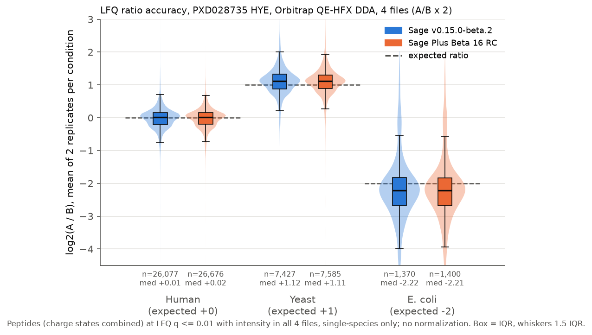

# Head-to-head: upstream Sage v0.15.0-beta.2 vs Sage Plus Beta 16 RC

One public dataset, one shared configuration, each engine otherwise at its own defaults.
Measured 2026-10-07 on the machine described below.

## Summary

On PXD028735 (HYE, Orbitrap QE-HFX DDA, 4 files), Sage Plus Beta 16 RC reports 1.2% more PSMs,
1.2% more peptides and 1.6% more protein groups at 1% than upstream Sage v0.15.0-beta.2. It ran
5% faster and peaked about 1.3 GiB lower in RSS. Both engines estimated the LFQ ratios with
almost the same accuracy and spread. The differences are small. Sage Plus did not beat upstream on
every measure: protein counts by `protein_q` are a tie (6,888 vs 6,893), and upstream's human
median ratio is slightly closer to 0.




## Results

Identifications are target-only counts taken from each engine's own q-values in its own output.
They were identical in every repeat run of an engine. Wall time and peak RSS come from
`/usr/bin/time -v`: the median of 3 runs, with each run listed.

| Metric | Upstream v0.15.0-beta.2 | Sage Plus Beta 16 RC |
|---|---:|---:|
| PSMs, spectrum q <= 1% | 247,102 | 250,060 |
| Unique peptides, peptide q <= 1% | 57,009 | 57,700 |
| Protein groups, protein-group q <= 1% | 6,916 | 7,028 |
| Unique `proteins` strings, protein q <= 1% | 6,888 | 6,893 |
| Wall time, s (median; runs) | 106.3 (106.3, 106.4, 101.9) | 100.8 (100.9, 100.4, 100.8) |
| Peak RSS, GiB (median; runs) | 7.53 (7.55, 7.46, 7.53) | 6.16 (6.16, 6.21, 6.15) |
| LFQ peptides at LFQ q <= 1% | 35,127 | 35,990 |
| ... with intensity in all 4 files | 35,119 | 35,981 |
| Human log2(A/B): n, median (expected 0), IQR, MAD | 26,077, +0.009, 0.367, 0.180 | 26,676, +0.017, 0.351, 0.169 |
| Yeast log2(A/B): n, median (expected +1), IQR, MAD | 7,427, +1.117, 0.448, 0.224 | 7,585, +1.114, 0.413, 0.205 |
| E. coli log2(A/B): n, median (expected -2), IQR, MAD | 1,370, -2.219, 0.866, 0.435 | 1,400, -2.215, 0.849, 0.421 |

Per file (PSMs / peptides / protein groups at 1%):

| File | Upstream | Sage Plus |
|---|---:|---:|
| Condition_A_Sample_Alpha_01 | 59,535 / 41,268 / 6,016 | 60,235 / 41,592 / 6,067 |
| Condition_B_Sample_Alpha_01 | 60,678 / 41,685 / 5,955 | 61,497 / 42,084 / 6,005 |
| Condition_A_Sample_Beta_01 | 63,358 / 42,422 / 6,110 | 64,074 / 42,736 / 6,189 |
| Condition_B_Sample_Beta_01 | 63,531 / 42,713 / 6,048 | 64,254 / 43,071 / 6,106 |

Protein groups per file count distinct groups among a file's PSMs at spectrum q <= 1% whose
run-level protein-group q-value is <= 1%. Sage Plus reports 50-80 more per file (about 1%). The
two engines assign peptides to groups and estimate protein-level q-values differently (see
"Defaults that differ"), so protein counts are not strictly comparable between them.

## Hardware and software

- CPU: Intel Core i7-10700K, 8 cores / 16 threads; 31 GiB RAM; Linux 6.8. Data on NVMe.
- Both engines used all 16 threads (their default) and loaded all 4 files in one batch.
- The machine was not idle. Three unrelated single-threaded Python workers were running
  throughout (load average about 14 on 16 threads), so absolute wall times are higher than on an
  idle machine. Runs alternated between engines and repeated within about 5%. Treat the 5% speed
  difference as within noise for a single dataset on a shared machine.
- Upstream: official release binary `sage-v0.15.0-beta.2-x86_64-unknown-linux-gnu`, run with
  `--disable-telemetry-i-dont-want-to-improve-sage`.
- Sage Plus: release build of branch `b16/integration`. `run-summary.json` records commit
  `8a8f84ba`. The worktree HEAD `958edb33` adds only edits to DOCS.md and README.md on top of it.
  The binary still reports version `0.1.0-beta.15`, because the RC's version number has not been
  bumped yet.

## Data

- PRIDE PXD028735, `LFQ_Orbitrap_DDA_Condition_{A,B}_Sample_{Alpha,Beta}_01.mzML` (converted
  locally; `Human_01` excluded).
- FASTA: `hye-irt-defined.fasta` (20,416 human, 6,067 yeast and 4,396 E. coli entries, plus iRT).
  Species come from the accession prefix (`human:`, `yeast:`, `ecoli:`).
- Expected ratios, from `/mnt/data1/sage-plus-scientific/20260914/quantification-plan.json`
  (`primary_ratios`): "B over A: human 1, yeast 0.5, E. coli 4", i.e. log2(A/B) = 0, +1, -2.

## Configuration and commands

Shared config: [`headtohead/config.json`](headtohead/config.json). It contains:
trypsin (`cleave_at` KR, `restrict` P, `missed_cleavages` 1, `semi_enzymatic` false), length 7-50;
static C +57.021464; variable M +15.994915, `max_variable_mods` 2; ion kinds b, y; generated
decoys; precursor ±10 ppm; fragment ±20 ppm; `isotope_errors` [-1, 3]; `deisotope` true;
`quant.lfq` true. Sage Plus accepted it with `--validate-only`. Upstream ran it without complaint,
so no keys were dropped. Edit its `fasta` and `mzml_paths` to your local copies.

```shell
export SAGE_UPSTREAM_BINARY=/path/to/sage-v0.15.0-beta.2/sage
export SAGE_PLUS_BINARY=/path/to/sage-plus/sage
export HEADTOHEAD_DIR=/path/to/output          # optional; defaults to benchmarks/headtohead
for n in 1 2 3; do benchmarks/headtohead/run.sh upstream $n; benchmarks/headtohead/run.sh plus $n; done
uv run --no-project --with pyarrow --with pandas --with matplotlib python benchmarks/headtohead/analyze.py
uv run --no-project --with pyarrow --with pandas --with matplotlib python benchmarks/headtohead/plot.py
```

`run.sh` wraps each engine in `/usr/bin/time -v` (and in `$SAGE_MEMGATE` when set). It writes
to `$HEADTOHEAD_DIR/{upstream,plus}/runN/` with `command.txt`, `config.used.json`, `time.txt` and
the logs. The engines ran one after the other, never at the same time. `analyze.py` writes
`metrics.json` and `lfq_ratios.parquet`; `plot.py` writes the figures to `figures/headtohead/`
(PNG at 150 dpi and SVG). [`headtohead/metrics.json`](headtohead/metrics.json) holds the measured
values.

## Metric definitions

- PSMs: target rows with `spectrum_q <= 0.01`. Upstream's log line "249,572 PSMs at 1% FDR" also
  counts 2,470 decoy rows; the table counts targets only, as the Sage Plus log does.
- Peptides: distinct modified `peptide` strings among target rows with `peptide_q <= 0.01`.
- Protein groups: distinct `protein_groups` among target PSMs at `spectrum_q <= 0.01` with
  `protein_group_q <= 0.01`. Proteins (`proteins` strings, `protein_q`) are filtered the same way.
  Both engines write these columns.
- LFQ: each engine's own LFQ table (upstream `lfq.tsv`, Sage Plus `lfq.parquet`). Both run at
  default settings: charge states combined, so rows are peptides, and cross-run feature tracing
  (MBR) is on. The filter is the same for both. It keeps target peptides with the engine's
  precursor-level LFQ `q_value <= 0.01`, intensity > 0 in all 4 files, and proteins from a single
  species. The ratio is log2(mean of the two A files / mean of the two B files), with no
  normalization. "Human-centered" errors in `metrics.json` subtract the human median.
- Not used: Sage Plus also reports a per-file `extraction_q_value`, which estimates the chance
  that a traced or transferred feature, or its quantity, comes from a wrong or random peak.
  Upstream has no equivalent, so it is left out to keep the LFQ comparison like for like. It is
  not a peptide-identification FDR.

## Defaults that differ (not exhaustive)

Everything outside the shared config is each engine's default, so these differences are part of
the comparison:

- Sage Plus clips initiator Met (`clip_n_term_met` true) and merges peptides that differ only in
  I/L (`merge_isoleucine_leucine` true). The I/L merge can lower distinct-peptide counts.
- Sage Plus scores deisotoping with averagine envelopes. Upstream uses its simpler deisotoping.
- Sage Plus aligns retention times nonlinearly. Upstream aligns them linearly.
- Peptide, protein and protein-group q-values: upstream ranks both members of each target/decoy
  pair and uses a KDE posterior-error sum; Sage Plus (Beta 13+) uses textbook picked competition,
  winners only, `(decoys + 1) / targets` (`benchmarks/PICKED_FDR.md`). Spectrum q is plain TDC in
  both.
- Sage Plus writes Parquet and keeps only PSMs at spectrum q <= 0.1. Upstream writes TSV and keeps
  all PSMs. Neither affects the 1% counts.
- Both engines use the same defaults for the remaining search settings. Sage Plus logged them:
  precursor charge 2-4, `min_matched_peaks` 4, `min_peaks` 15, `max_peaks` 150, peptide mass
  500-5000, `min_ion_index` 2.

## Caveats

- This is a single dataset (Orbitrap DDA, 4 files). The gains are about 1-2% and may not
  generalize. The out-of-the-box defaults mix several changes, so this run does not attribute
  the differences to any one feature.
- Wall time was measured on a shared machine with background load (see above). In earlier runs on
  other datasets, upstream has been the faster engine. Here, Sage Plus was faster by about
  5 seconds.
- The LFQ ratios are not normalized. Both engines overestimate the yeast ratio (+0.11 log2) and
  the size of the E. coli ratio (-0.22 log2) by almost the same amount, so the bias probably comes
  from the samples or from loading rather than from either engine.
